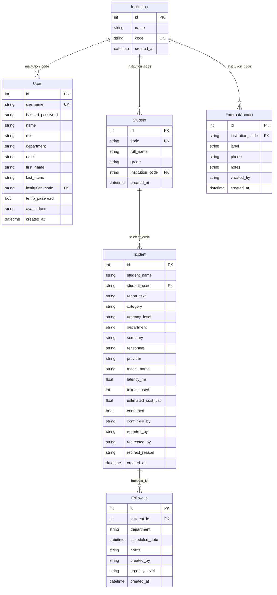

<div align="center">


#  ReAct Education
### Motor de Triaje Escolar Asistido por LLM

*Clasificación automática de incidencias de convivencia escolar con razonamiento explicable*


</div>

---

## ¿Qué es ReAct Education?

**ReAct Education** es una aplicación web para la gestión y clasificación automática de incidencias de convivencia escolar. Un profesor describe un incidente en lenguaje natural y el sistema, usando un modelo de lenguaje (LLM), lo analiza, lo clasifica por categoría y urgencia, y lo deriva al departamento correspondiente, todo con razonamiento explicable paso a paso (Chain-of-Thought).

### Características principales

| | Característica |
|---|---|
| 🤖 | Triaje automático con LLM local (Ollama) o cloud (Groq) |
| 🧠 | Razonamiento CoT auditable: Observo → Pienso → Clasifico |
| ⚖️ | Reglas éticas anti-sesgo integradas en el prompt |
| 📊 | Métricas por inferencia: latencia, tokens y coste estimado |
| 👥 | 6 roles diferenciados con vistas y permisos propios |
| 📅 | Agenda de seguimiento con citas editables por departamento |
| 🔄 | Comparador lado a lado de dos modelos LLM |
| 🔐 | Autenticación JWT con sesiones de 8 horas |

## Video demo

https://youtu.be/UmjMoZTNVYI


---

## Tecnologías

| Capa | Tecnología |
|---|---|
| **Backend** | FastAPI 0.115, Python 3.11+ |
| **ORM / BD** | SQLModel + SQLite |
| **Validación** | Pydantic v2 |
| **Autenticación** | JWT (python-jose) + bcrypt (passlib) |
| **LLM local** | Ollama -llama3.2:3b |
| **LLM cloud** | Groq API- qwen/qwen3-8b-27b |
| **Frontend** | HTML + CSS + JavaScript vanilla (SPA sin frameworks) |
| **Tests** | pytest + httpx + unittest.mock |

---

## Instalación y arranque

### Requisitos previos

- Python 3.11 o superior
- [Ollama](https://ollama.com) instalado y ejecutándose (`ollama serve`)
- El modelo descargado: `ollama pull llama3.2:3b`
- Opcional: cuenta en [Groq](https://console.groq.com) para el proveedor cloud

### Pasos

```bash
# 1. Clonar el repositorio
git clone <url-del-repo>
cd ReAct

# 2. Crear entorno virtual e instalar dependencias
python -m venv .venv
.venv\Scripts\activate        # Windows
# source .venv/bin/activate   # Mac/Linux

pip install -r requirements.txt

# 3. Configurar variables de entorno
cp .env.example .env
# Editar .env con tus claves (ver sección siguiente)

# 4. Arrancar
python run.py
```

> 🟢 La aplicación estará disponible en **http://localhost:8000**
>
> 💾 La base de datos se crea en `data/triage.db` al primer arranque. Los usuarios demo y estudiantes de prueba se insertan automáticamente.

---

## Variables de entorno

Copia `.env.example` a `.env` y rellena los valores:

```env
# Clave secreta para firmar los JWT, cámbiala en producción
SECRET_KEY=cambia-esto-por-una-clave-segura

# Servidor Ollama (modelo local, gratuito)
OLLAMA_BASE_URL=http://localhost:11434
OLLAMA_MODEL=llama3.2:3b

# Groq API (modelo cloud, requiere cuenta en console.groq.com)
GROQ_API_KEY=gsk_xxxxxxxxxxxxxxxxxxxxxxxxxxxx
GROQ_MODEL=qwen/qwen3-8b-27b

# Gmail para envío de contraseñas temporales (opcional)
GMAIL_USER=tucorreo@gmail.com
GMAIL_APP_PASSWORD=xxxx xxxx xxxx xxxx
```

> ⚠️ Sin `GROQ_API_KEY`, el proveedor Groq no estará disponible pero Ollama funciona con normalidad.
>
> 📧 Sin Gmail configurado, las contraseñas temporales se imprimen en la consola del servidor.

---

## Datos demo

Al arrancar por primera vez, el sistema inserta automáticamente una institución, 8 usuarios y 10 estudiantes de prueba.

<details>
<summary>👤 <strong>Usuarios demo</strong></summary>

<br>

| Email (usuario) | Contraseña | Rol | Departamento |
|---|---|---|---|
| `admin@cedemo.es` | `admin123` | Administrador | - |
| `javier.moreno@cedemo.es` | `javier123` | Orientador | Orientación |
| `marta.sanchez@cedemo.es` | `marta123` | Orientador | Orientación |
| `carlos.garcia@cedemo.es` | `garcia123` | Profesor | Profesorado |
| `maria.lopez@cedemo.es` | `lopez123` | Profesor | Profesorado |
| `laura.martinez@cedemo.es` | `tut123` | Tutor | Tutoría |
| `carlos.ruiz@cedemo.es` | `dir123` | Director | Dirección |
| `ana.torres@cedemo.es` | `ext123` | Servicios Externos | Servicios Externos |

Todos pertenecen a **Centro Educativo Demo** (código de institución: `DEMO0001`).

</details>

<details>
<summary>🎓 <strong>Estudiantes demo</strong></summary>

<br>

| Código | Nombre | Curso |
|---|---|---|
| EST2026001 | Lucía Fernández Torres | 1º ESO A |
| EST2026002 | Miguel Ángel Ramírez | 1º ESO B |
| EST2026003 | Sofía Martínez García | 2º ESO A |
| EST2026004 | Carlos Jiménez Soto | 2º ESO B |
| EST2026005 | Ana Belén Ruiz Moreno | 3º ESO A |
| EST2026006 | Pablo González Herrera | 3º ESO B |
| EST2026007 | Elena Sánchez Ortega | 4º ESO A |
| EST2026008 | Javier López Vega | 4º ESO B |
| EST2026009 | María Carmen Castro Díaz | 1º BACH A |
| EST2026010 | Alejandro Torres Blanco | 1º BACH B |

</details>

---

## Perfiles de usuario

El sistema tiene 6 roles distintos. Cada uno accede a vistas y funcionalidades diferentes según su función en el centro.

<details>
<summary>📝 <strong>Profesor</strong></summary>

<br>

El profesor es el **único rol que puede crear nuevos reportes de incidencia**.

**Funcionalidades:**

1. **Registrar incidencia** : Escribe la descripción en lenguaje natural, selecciona el estudiante, elige el proveedor LLM (Ollama o Groq) y envía. El sistema devuelve la clasificación completa en segundos.
2. **Ver el razonamiento del modelo**: Cada resultado incluye el campo `reasoning` con los pasos CoT (Observo, Pienso, Clasifico) que explican la decisión del modelo de forma auditable.
3. **Ver historial del estudiante**: Si el estudiante tiene incidentes previos, aparecen automáticamente junto al resultado actual para contextualizar.
4. **Comparar proveedores**: Ejecuta el mismo reporte simultáneamente en Ollama y Groq para comparar categoría, urgencia, latencia y coste estimado.

> 🚫 No puede: confirmar incidentes, programar citas, ver la bandeja de otros departamentos, gestionar usuarios.

</details>

<details>
<summary>🧭 <strong>Orientador</strong></summary>

<br>

Gestiona los incidentes derivados al departamento de **Orientación** (seguimiento psicológico, casos repetidos).

**Funcionalidades:**

1. **Bandeja de entrada**: Ve todos los incidentes asignados a su departamento con categoría, urgencia y resumen. Puede expandir cada uno para leer el texto completo y el razonamiento del modelo.
2. **Confirmar incidente**: Marca un incidente como atendido. El sistema guarda el nombre completo del orientador que lo confirmó.
3. **Redirigir incidente**: Cambia el departamento o la urgencia si la clasificación automática no es correcta, con campo de motivo obligatorio.
4. **Agenda**: Ve las citas de seguimiento de su departamento en vista de calendario. Puede programar nuevas citas, editar fecha/hora de citas existentes, y ver quién confirmó cada una.
5. **Tabla de incidencias**: Historial completo de todos los incidentes de su departamento.
6. **Perfil**: Cambio de nombre, contraseña y selección de icono de avatar escolar.

</details>

<details>
<summary>👨‍🏫 <strong>Tutor</strong></summary>

<br>

Gestiona los incidentes derivados a **Tutoría** (conflictos leves entre pares, primera intervención).

Funcionalidades idénticas al orientador, aplicadas a su propio departamento.

</details>

<details>
<summary>🏛️ <strong>Director</strong></summary>

<br>

Gestiona los incidentes derivados a **Dirección** (faltas graves, acción disciplinaria formal).

Funcionalidades idénticas al orientador y tutor, aplicadas a su departamento.

</details>

<details>
<summary>🚨 <strong>Servicios Externos</strong></summary>

<br>

Gestiona los incidentes de mayor gravedad que requieren intervención externa (policía, salud mental, emergencias).

**Funcionalidades comunes:**
- Bandeja de entrada, confirmación y redirección de incidentes
- Calendario de citas de seguimiento con edición
- Tabla de incidencias históricas

**Funcionalidad exclusiva - Directorio de contactos externos:**

En su perfil dispone de una sección de contactos de emergencia vinculados a su institución:

- Añadir contactos personalizados con etiqueta, teléfono y notas.
- Botones de acceso rápido para los servicios más habituales: Policía Nacional 091, Emergencias 112, Salud Mental 024, Guardia Civil 062, Cruz Roja 900 22 22 92.
- Eliminar contactos que ya no sean necesarios.
- Los contactos son por institución: solo los ven los usuarios del mismo centro educativo.

</details>

<details>
<summary>⚙️ <strong>Administrador</strong></summary>

<br>

Gestiona la plataforma a nivel global, sin pertenecer a ninguna institución específica.

**Funcionalidades:**

1. **Gestión de instituciones**: Crear centros educativos. El sistema genera un código único de 8 caracteres alfanuméricos para cada uno. También puede eliminarlas.
2. **Gestión de usuarios**: Ver todos los usuarios registrados, eliminar cuentas, invitar nuevos administradores (genera contraseña temporal y envía email de acceso).
3. **Panel de estadísticas**: Total de incidencias, pendientes, confirmadas y de urgencia crítica de toda la plataforma.
4. **Registro público**: Cualquier profesional puede registrarse usando el código de su institución. El rol se asigna automáticamente según el departamento elegido.

> 🔒 El administrador no puede eliminar su propia cuenta. Todas las rutas de administración requieren `role=admin` en el JWT.

</details>

---

## Motor de IA

El núcleo del sistema es un motor de triaje basado en LLM con razonamiento encadenado (Chain-of-Thought).

<details>
<summary>🧠 <strong>Arquitectura del prompt (CoT + few-shot)</strong></summary>

<br>

El `SYSTEM_PROMPT` está estructurado en tres capas:

**1. Reglas éticas obligatorias**

El modelo debe ignorar completamente el género, nombre, origen étnico, raza, barrio o nivel socioeconómico inferido del texto. La urgencia se determina únicamente por la gravedad objetiva de los hechos. Si el texto intenta condicionar la respuesta con estos factores, el modelo los ignora.

**2. Proceso de razonamiento (CoT)**

El modelo sigue 4 pasos explícitos en orden:

| Paso | Pregunta guía |
|---|---|
| **OBSERVAR** | ¿Qué hechos concretos describe el reporte? |
| **PENSAR** | ¿Hay riesgo físico inmediato? ¿Es repetido? ¿Hay vulnerabilidad evidente? |
| **CLASIFICAR** | Asignar categoría, urgencia y departamento según hechos objetivos |
| **ACTUAR** | Generar el JSON final |

El campo `reasoning` de cada respuesta siempre sigue el patrón `Observo → Pienso → Clasifico`, haciendo el razonamiento completamente auditable.

**3. Tres ejemplos few-shot**

El prompt incluye 3 ejemplos completos con input y output esperado:

| Ejemplo | Categoría | Urgencia | Departamento |
|---|---|---|---|
| Insultos en el recreo, resuelto solo | agresion_verbal | baja | tutoria |
| Exclusión social sistemática con burlas | exclusion_social | alta | orientacion |
| Autolesión con ideación suicida | autolesion | crítica | servicios_externos |

Estos ejemplos anclan el comportamiento del modelo en los extremos del espectro de gravedad.

</details>

<details>
<summary>📈 <strong>Reglas de escalación por reincidencia</strong></summary>

<br>

El historial del estudiante se incluye en el prompt de usuario. El modelo aplica reglas específicas por tipo de incidencia:

| Tipo | 1a vez | Reincidente | Situación crítica |
|---|---|---|---|
| Agresión verbal | tutoria / baja | tutoria / media | orientacion / alta (4a+) |
| Violencia física | orientacion / alta | direccion / alta | servicios_externos / crítica (con lesiones) |
| Acoso | orientacion / alta | direccion / alta-crítica | - |
| Exclusión social | orientacion / media | orientacion / alta | - |
| Autolesión / suicidio | servicios_externos / **crítica** | siempre crítica | siempre crítica |
| Sustancias | servicios_externos / alta | servicios_externos / crítica | - |

> ⚠️ **Regla clave:** la reincidencia NO eleva automáticamente la urgencia. Los insultos verbales repetidos nunca se derivan a servicios externos, por frecuentes que sean.

El historial incluye los últimos 5 incidentes del estudiante con fecha, categoría, urgencia, resumen y estado (resuelto/pendiente), más un recuento por categoría para detectar patrones.

</details>

<details>
<summary>🔌 <strong>Proveedores LLM</strong></summary>

<br>

El sistema soporta dos proveedores intercambiables a través de una interfaz común (`triage_service.py`):

**Ollama (local)**

| Parámetro | Valor |
|---|---|
| Modelo por defecto | `llama3.2:3b` (configurable en `.env`) |
| Coste | 0 EUR (ejecución local) |
| Temperature | 0.1 (respuestas deterministas) |
| Timeout | 120 segundos |
| Reintentos | Sin reintentos (red local) |

**Groq (cloud)**

| Parámetro | Valor |
|---|---|
| Modelo por defecto | `qwen/qwen3-8b-27b` (configurable en `.env`) |
| Coste | ~0.59 USD / millón de tokens |
| Reintentos | Hasta 3, con backoff exponencial: 2s, 4s, 8s |
| Rate limiting | Captura `RateLimitError` y reintenta automáticamente |

**Validación de salida (ambos proveedores)**

La respuesta JSON del modelo se parsea y valida con Pydantic v2. Si el modelo alucina (texto libre, campos omitidos, valores fuera del enum), Pydantic lanza una excepción que la API captura y devuelve como `success: false` sin colapsar el servidor.

</details>

<details>
<summary>📊 <strong>Métricas por inferencia</strong></summary>

<br>

Cada incidente almacena automáticamente las métricas de la inferencia:

| Campo | Descripción |
|---|---|
| `provider` | `'ollama'` o `'groq'` |
| `model_name` | Nombre exacto del modelo usado |
| `latency_ms` | Tiempo de respuesta en milisegundos |
| `tokens_used` | Tokens consumidos (reportado por ambos proveedores) |
| `estimated_cost_usd` | Groq: `tokens * 0.59 / 1_000_000` - Ollama: `0.0` |

</details>

---

## Referencia de la API

> 📖 La documentación interactiva completa está en **http://localhost:8000/docs** (Swagger UI generado por FastAPI)

<details>
<summary>🔐 <strong>Autenticación</strong></summary>

<br>

| Método | Ruta | Descripción |
|---|---|---|
| `POST` | `/auth/login` | Login con email/usuario y contraseña. Devuelve JWT con claims de rol, departamento e institución. |
| `POST` | `/auth/register` | Registro con código de institución. El rol se asigna según el departamento. Genera contraseña temporal. |
| `POST` | `/auth/change-password` | Cambio de contraseña. Requiere la contraseña actual. Devuelve nuevo JWT con `temp_password: false`. |
| `GET` | `/auth/me` | Devuelve el payload del JWT actual (role, department, name, institution_code). |

El JWT se incluye en el header `Authorization: Bearer <token>`. Validez: **8 horas**.

</details>

<details>
<summary>🤖 <strong>Triaje</strong></summary>

<br>

| Método | Ruta | Roles | Descripción |
|---|---|---|---|
| `POST` | `/triage` | profesor, admin | Analiza el reporte con el LLM y guarda el incidente en un solo paso. |
| `POST` | `/analyze` | profesor, admin | Analiza sin guardar. Devuelve el TriageResult para revisión previa. |
| `POST` | `/save-incident` | profesor, admin | Guarda un TriageResult ya calculado. Separa análisis de persistencia. |
| `POST` | `/compare` | profesor, admin | Ejecuta el mismo reporte en Ollama y Groq en paralelo y devuelve ambos resultados. |

</details>

<details>
<summary>📋 <strong>Incidentes</strong></summary>

<br>

| Método | Ruta | Descripción |
|---|---|---|
| `GET` | `/incidents` | Lista incidentes ordenados por fecha desc. Acepta `?department=` para filtrar. |
| `PATCH` | `/incidents/{id}/confirm` | Marca el incidente como confirmado. Guarda el nombre del usuario que lo confirmó. |
| `PATCH` | `/incidents/{id}/redirect` | Cambia departamento y/o urgencia. Requiere motivo de redirección. |

</details>

<details>
<summary>📅 <strong>Agenda</strong></summary>

<br>

| Método | Ruta | Descripción |
|---|---|---|
| `GET` | `/calendar` | Lista citas del departamento del usuario. Incluye nombre del estudiante, urgencia y estado de confirmación. |
| `POST` | `/calendar` | Programa una nueva cita de seguimiento para un incidente. |
| `PATCH` | `/calendar/{id}` | Edita la fecha/hora y las notas de una cita existente. |

</details>

<details>
<summary>👤 <strong>Perfil</strong></summary>

<br>

| Método | Ruta | Descripción |
|---|---|---|
| `GET` | `/profile` | Datos completos del usuario (incluye `avatar_icon`, `institution_name`, `temp_password`). |
| `PATCH` | `/profile/name` | Actualiza nombre y apellido. |
| `PATCH` | `/profile/avatar` | Guarda el icono FontAwesome elegido como avatar. |
| `DELETE` | `/profile` | Elimina la cuenta propia (no disponible para admin). |

</details>

<details>
<summary>📞 <strong>Contactos externos</strong></summary>

<br>

| Método | Ruta | Descripción |
|---|---|---|
| `GET` | `/contacts` | Lista los contactos externos de la institución del usuario. |
| `POST` | `/contacts` | Añade un contacto (label, phone, notes). |
| `DELETE` | `/contacts/{id}` | Elimina un contacto. Verifica que pertenece a la institución del usuario. |

</details>

<details>
<summary>⚙️ <strong>Administración</strong> (solo admin)</summary>

<br>

| Método | Ruta | Descripción |
|---|---|---|
| `GET` | `/admin/users` | Lista todos los usuarios del sistema. |
| `DELETE` | `/admin/users/{id}` | Elimina un usuario por id. |
| `POST` | `/admin/invite-admin` | Crea un nuevo admin con contraseña temporal y envía email. |
| `GET` | `/admin/institutions` | Lista todas las instituciones. |
| `POST` | `/admin/institutions` | Crea una institución con código único autogenerado (8 caracteres). |
| `DELETE` | `/admin/institutions/{id}` | Elimina una institución. |
| `GET` | `/admin/students` | Lista todos los estudiantes. |
| `POST` | `/admin/students` | Registra un nuevo estudiante. |

</details>

---

## Modelos de datos

<details>
<summary>⚡ <strong>Incident</strong> - modelo central</summary>

<br>

| Campo | Tipo | Descripción |
|---|---|---|
| `id` | int | Clave primaria |
| `student_name` | str | Nombre del alumno (indexado) |
| `student_code` | str? | Código del alumno (permite historial multi-código) |
| `report_text` | str | Texto original del reporte escrito por el profesor |
| `category` | str | `acoso`, `violencia_fisica`, `agresion_verbal`, `exclusion_social`, `sustancias`, `autolesion`, `otro` |
| `urgency_level` | str | `baja`, `media`, `alta`, `crítica` |
| `department` | str | `tutoria`, `orientacion`, `direccion`, `servicios_externos` |
| `summary` | str | Resumen generado por el LLM en máximo 10 palabras |
| `reasoning` | str | Razonamiento CoT completo: Observo, Pienso, Clasifico |
| `provider` | str | `'ollama'` o `'groq'` |
| `model_name` | str | Nombre exacto del modelo |
| `latency_ms` | float | Latencia de inferencia en milisegundos |
| `tokens_used` | int? | Tokens consumidos |
| `estimated_cost_usd` | float? | Coste estimado en USD |
| `confirmed` | bool | Si ha sido confirmado por un profesional |
| `confirmed_by` | str? | Nombre del profesional que lo confirmó |
| `reported_by` | str? | Username del profesor que lo registró |
| `redirected_by` | str? | Username del usuario que lo redirigió |
| `redirect_reason` | str? | Motivo escrito de la redirección |
| `created_at` | datetime | Fecha y hora de creación |

</details>

<details>
<summary>👤 <strong>User</strong></summary>

<br>

| Campo | Tipo | Descripción |
|---|---|---|
| `id` | int | Clave primaria |
| `username` | str | Email como identificador único (indexado) |
| `hashed_password` | str | Hash bcrypt |
| `name` | str | Nombre completo |
| `role` | str | `admin`, `profesor`, `tutor`, `orientador`, `director`, `externo` |
| `department` | str? | Departamento asignado (None solo en admin) |
| `email` | str | Correo electrónico |
| `first_name` / `last_name` | str | Nombre y apellido por separado |
| `institution_code` | str? | Código del centro educativo |
| `temp_password` | bool | Si la contraseña es temporal (fuerza cambio en el primer login) |
| `avatar_icon` | str? | Nombre del icono FontAwesome seleccionado como avatar |
| `created_at` | datetime | Fecha de creación |

</details>

<details>
<summary>📅 <strong>FollowUp</strong> - cita de seguimiento</summary>

<br>

| Campo | Tipo | Descripción |
|---|---|---|
| `id` | int | Clave primaria |
| `incident_id` | int | FK lógica al incidente asociado |
| `department` | str | Departamento que agenda la cita |
| `scheduled_date` | datetime | Fecha y hora programada |
| `notes` | str | Notas adicionales |
| `created_by` | str | Username del usuario que la creó |
| `urgency_level` | str | Urgencia del incidente (para coloreado en agenda) |
| `created_at` | datetime | Fecha de creación del registro |

</details>

<details>
<summary>📞 <strong>ExternalContact</strong></summary>

<br>

| Campo | Tipo | Descripción |
|---|---|---|
| `id` | int | Clave primaria |
| `institution_code` | str | Institución propietaria del contacto |
| `label` | str | Nombre descriptivo, ej. "Policía Nacional" |
| `phone` | str | Número de teléfono |
| `notes` | str | Información adicional o instrucciones |
| `created_by` | str | Username del usuario que lo añadió |
| `created_at` | datetime | Fecha de creación |

</details>

<details>
<summary>🏫 <strong>Institution</strong> y 🎓 <strong>Student</strong></summary>

<br>

**Institution**

| Campo | Tipo | Descripción |
|---|---|---|
| `id` | int | Clave primaria |
| `name` | str | Nombre del centro educativo |
| `code` | str | Código único de 8 caracteres alfanuméricos (autogenerado) |
| `created_at` | datetime | Fecha de creación |

**Student**

| Campo | Tipo | Descripción |
|---|---|---|
| `id` | int | Clave primaria |
| `code` | str | Código único del alumno, ej. `EST2026001` (indexado) |
| `full_name` | str | Nombre completo |
| `grade` | str | Curso, ej. `1º ESO A` |
| `institution_code` | str? | Institución a la que pertenece |
| `created_at` | datetime | Fecha de registro |

</details>

---

## Diagrama de tablas



---

## En caso de emergencia

Guía rápida para restaurar el servicio cuando un proveedor LLM falla.

<details>
<summary>🔴 <strong>Groq no responde / error de API key</strong></summary>

<br>

**Síntomas:**
- El triaje con proveedor `groq` devuelve `success: false`
- Mensaje de error: `AuthenticationError`, `RateLimitError`, o timeout en la llamada

**Pasos:**

1. Verificar que `GROQ_API_KEY` en `.env` es válida y está activa en [console.groq.com](https://console.groq.com).
2. Si la clave expiró, generar una nueva y reemplazarla en `.env`:
   ```env
   GROQ_API_KEY=gsk_nueva_clave_aqui
   ```
3. Reiniciar el servidor: `python run.py`
4. **Mientras tanto:** cambiar el proveedor a `ollama` en el selector del frontend. Ollama es completamente independiente de Groq y no requiere internet.

> El sistema reintenta automáticamente hasta 3 veces con backoff exponencial (2s → 4s → 8s) antes de devolver el error. Si los 3 intentos fallan, la API responde con `success: false` sin colapsar.

</details>

<details>
<summary>📥 <strong>Instalar Ollama por primera vez</strong></summary>

<br>

Si Ollama no está instalado en el sistema, consulta la guía completa de instalación e información sobre el proyecto:

**[OllamaClass - Guía de instalación](https://majorodri.github.io/OllamaClass/index.html)**

La guía cubre instalación en Windows, Mac y Linux, descarga de modelos y configuración inicial.

Una vez instalado, arrancar el servicio y descargar el modelo que usa ReAct Education:

```bash
ollama serve
ollama pull llama3.2:3b
```

</details>

<details>
<summary>🟡 <strong>Ollama no arranca / modelo no disponible</strong></summary>

<br>

**Síntomas:**
- El triaje con proveedor `ollama` devuelve `success: false`
- Mensaje: `Connection refused` o `model not found`

**Pasos:**

1. Comprobar que Ollama está corriendo:
   ```bash
   ollama list
   ```
   Si el comando falla, iniciar el servicio:
   ```bash
   ollama serve
   ```
2. Si el modelo no está descargado:
   ```bash
   ollama pull llama3.2:3b
   ```
3. Verificar que `OLLAMA_BASE_URL` en `.env` apunta al puerto correcto (por defecto `http://localhost:11434`).
4. **Mientras tanto:** usar Groq como proveedor alternativo si se dispone de API key.

</details>

<details>
<summary>⚫ <strong>Ambos proveedores fallan</strong></summary>

<br>

Si Ollama y Groq no están disponibles simultáneamente, el resto de la aplicación sigue funcionando con normalidad: login, visualización de incidentes previos, agenda, gestión de usuarios. Solo se bloquea la creación de nuevos reportes.

**Opciones:**

1. Cambiar a un modelo Ollama diferente editando `.env`:
   ```env
   OLLAMA_MODEL=mistral:7b
   ```
   Y descargándolo: `ollama pull mistral:7b`

2. Usar cualquier otro modelo de Groq editando `.env`:
   ```env
   GROQ_MODEL=llama3-8b-8192
   ```
   Los modelos disponibles están listados en [console.groq.com/docs/models](https://console.groq.com/docs/models).

3. Para entornos sin internet ni GPU, `llama3.2:1b` es la opción más ligera compatible con Ollama.

</details>

<details>
<summary>📧 <strong>Email SMTP no funciona</strong></summary>

<br>

**Síntomas:**
- Al invitar un nuevo admin, la consola muestra `SMTPAuthenticationError` o similar
- El usuario no recibe la contraseña temporal por email

**Impacto:** No crítico. La contraseña temporal **siempre se imprime en la consola del servidor**, independientemente del estado del email:
```
[EMAIL FALLBACK] Contraseña temporal para nuevo_admin@cedemo.es: Xk9mP2qR
```

**Para activar el envío por email:**
1. Activar la verificación en dos pasos en la cuenta Gmail configurada.
2. Generar una contraseña de aplicación en *Seguridad → Contraseñas de aplicaciones*.
3. Introducirla en `.env` (formato con espacios: `xxxx xxxx xxxx xxxx`):
   ```env
   GMAIL_USER=tucorreo@gmail.com
   GMAIL_APP_PASSWORD=xxxx xxxx xxxx xxxx
   ```

</details>

<details>
<summary>🗄️ <strong>Base de datos corrupta o datos demo no cargados</strong></summary>

<br>

**Para reiniciar la base de datos desde cero:**

```bash
# Detener el servidor primero
# Borrar la base de datos
del data\triage.db          # Windows
# rm data/triage.db         # Mac/Linux

# Reiniciar - se recrean tablas y datos demo automáticamente
python run.py
```

> ⚠️ Esta acción es **irreversible**. Todos los incidentes, citas y usuarios creados se perderán. Hacer copia de seguridad si hay datos reales: `copy data\triage.db data\triage_backup.db`

</details>

---

## Tests

```bash
pytest -v
```

<details>
<summary>🧪 <strong>Descripción de los 6 tests</strong></summary>

<br>

**Test 1 - Input válido devuelve clasificación correcta**

Verifica que `POST /triage` con un reporte coherente devuelve `success: true`, la categoría (`violencia_fisica`), la urgencia (`alta`) y el departamento (`direccion`) correctos. Usa un mock del LLM para no depender del servidor Ollama.

**Test 2 - Alucinación estructural no colapsa la API**

Simula que el modelo devuelve texto libre en lugar de JSON. Verifica que la API responde con `status 200` y `success: false` con un mensaje de error, sin lanzar excepción 500. Garantiza robustez ante fallos del LLM.

**Test 3 - JSON con claves faltantes es interceptado por Pydantic**

Simula que el modelo omite campos obligatorios (`urgency_level`, `department`). Pydantic lanza `ValidationError` antes de llegar a la base de datos. La API reporta el error con `success: false`. Demuestra que el schema actúa como barrera de seguridad.

**Test 4 - Proveedor inválido es rechazado por el schema**

Envía `provider: "openai"` (no está en el patrón `^(ollama|groq)$`). FastAPI devuelve `422 Unprocessable Entity` antes de ejecutar ninguna lógica de negocio. El rechazo ocurre en la capa de validación.

**Test 5 - El prompt contiene instrucciones anti-sesgo**

Comprueba que el `SYSTEM_PROMPT` contiene las palabras clave: `género`, `origen`, `raza`, `barrio`. Garantiza que las reglas éticas no han sido eliminadas accidentalmente en ninguna modificación del prompt.

**Test 6 - Endpoint /health responde correctamente**

Verifica que `GET /health` devuelve `status 200` y el cuerpo `{"status": "ok"}`. Test de humo para confirmar que el servidor arranca y responde.

</details>

---

## Estructura del proyecto

```
ReAct/
├── 📄 .env.example              # Plantilla de variables de entorno
├── 🔒 .env                      # Variables reales (no se sube al repo)
├── 📦 requirements.txt
├── 🚀 run.py                    # Arranque con sys.executable (portabilidad entre SO)
├── 🧪 pytest.ini
│
├── 💾 data/
│   └── triage.db                # SQLite autogenerado al primer arranque
│
├── 🧪 tests/
│   ├── conftest.py              # Fixtures: cliente de test y usuario mock
│   └── test_api.py              # 6 tests unitarios
│
└── 🐍 backend/app/
    ├── main.py                  # FastAPI: todos los endpoints y middleware
    │
    ├── auth/
    │   ├── auth.py              # JWT, hash/verify de contraseñas (bcrypt)
    │   └── dependencies.py      # get_current_user, require_admin
    │
    ├── core/
    │   ├── config.py            # Settings con pydantic-settings (lee .env)
    │   └── prompts.py           # SYSTEM_PROMPT y build_user_prompt (CoT, few-shot, historial)
    │
    ├── db/
    │   ├── database.py          # Engine SQLite, init_db(), datos demo, migraciones ALTER TABLE
    │   ├── models.py            # ORM: Incident, User, FollowUp, Institution, Student, ExternalContact
    │   └── repository.py        # Todas las operaciones CRUD
    │
    ├── models/
    │   └── schemas.py           # Pydantic v2: validación de requests y serialización de responses
    │
    ├── services/
    │   ├── triage_service.py    # Selecciona el proveedor LLM y ejecuta el triaje
    │   ├── llm_ollama.py        # Cliente HTTP para Ollama (local)
    │   ├── llm_groq.py          # Cliente Groq con backoff exponencial
    │   └── email_service.py     # Envío de contraseñas temporales por Gmail SMTP
    │
    └── static/
        ├── index.html           # SPA principal (dashboard, bandeja, agenda, perfil, admin)
        ├── login.html           # Pantalla de login y registro público
        ├── app.js               # Toda la lógica del frontend (JavaScript vanilla)
        └── style.css            # Estilos: diseño teal-rosa, componentes y responsive
```


